# 1. __AI for Medical Diagnosis:__

### - In particula, you will:
- ### Data preparation : Pre-process (visualization) and prepare a real-world X-ray dataset (data leakage prevention).
- ### Model development : Implement and evaluate a deep learning model for multi-class classification of chest pathology.
-  ### Model evaluation : Use various metrics (ROC, AUC, etc.) to evaluate your model and test its robustness.
-  ### Visualize model : Use GradCAMs to inspect model decisions and visually validate performance.


<br />
<br />

###  - Definition of "Lung Mass": A lung mass is defined as an abnormal spot or area in the lungs that are more than 3 centimeters (cm), about 1.5 inches, in size. Spots smaller than 3 cm in diameter are considered lung nodules. The most common causes of a lung mass differ from that of a lung nodule, as well as the chance that the abnormality may be cancer. [reference](https://www.verywellhealth.com/lung-mass-possible-causes-2249386)


<br />

### - __Training:__ During training, an algorithm is shown images of chest X-rays labeled with whether they contain a mass or not.
### - __Prediction:__ The algorithm produces an output in the form of scores, which are probabilities that the image contains a mass.
###  - ___Loss:___ From the probability score that the model predicted, we compute "Error" with the desired score.


<br />


## - Data Exploration & Image Pre-processing:
- ### Below are the common steps to check the data.
  ### 1. Data types and null values check.
  ### 2. Check the distribution of the data.
  ### 3. Unique IDs check.
  ### 4. Explore data labels.
  ### 5. Investigate a single image. 
  ### 6. Investigate pixel value distribution.
  ### 7. Standardization by subtracting the mean and dividing by the standard deviation.


<br />

## - How to handle class imbalance and small training sets:
### It is worth noting that our dataset contains multiple images for each patient. This could be the case, for example, when a patient has taken multiple X-ray images at different times during their hospital visits. In our data splitting, we have ensured that the split is done on the patient level so that there is no data "leakage" between the train, validation, and test datasets.


### - ___Image Classfication and Class Imbalance:___
- ### Three Key Challenges

    - ### Class Imbalance
    - ### Multi-Task
    - ### Dataset Size


<br />

- ### __Class Imbalance Problem:__ it's common to have not an equal number of examples of non-disease and disease.


<br />

###  to solve "Class Imbalance":

- ### Weighted Loss : By counting the number of each labels and modifying the loss function to weighted loss with the ratio of each label.

<p float="left">
   
  
</p>


<br />

- ### Resampling : Re-sample the dataset such that we have an equal number of normal and abnormal examples. 
    - ### With Resampling, you can use just standard loss function (not a weighted loss function).
- ###  There are many variations of Resampling:
  - ### Oversampling the normal/abnormal case.
  - ### Undersampling the normal/abnormal case.

<br />

### - For if you find that your training set has 70% negative examples and 30% positive:

- ### reweight examples in training loss.
- ### undersample negative examples.
- ### oversample positive examples.

<br />

### - __Binary Cross Entropy Loss Function__:
- ### Binary Cross Entropy Loss Function is used for binary classification problems.

<p float="left">
   
</p>


<br />

### - __Multi-task challenge:__
- ### In the real world, we often have multiple labels for a single image. For example, a patient may have multiple diseases, or a patient may have multiple abnormalities in a single image. In this case, we need to predict multiple labels for a single image. This is called a multi-task problem.


<br />

### - __Dataset Size:__

- ### the common dataset size in medical imaging is about 10 thousand to 100 thousand. This is a small dataset compared to the millions of images in ImageNet. This is because it is expensive to collect medical images and it requires a lot of expertise to label the images. In addition, medical images are often private and sensitive, so it is difficult to share them with others.

### - __Transfer Learning:__
- ### Transfer learning is a technique that allows us to use a pre-trained model on a new dataset. This is useful when we have a small dataset and we want to use a pre-trained model that was trained on a large dataset. In this case, we can use the pre-trained model as a starting point and fine-tune the model on our dataset. This is called transfer learning.

- ### How to use transfer learning:
  - ### To fune tune all of the layers. (We use this method when we have a big dataset.)
  - ### To freeze some of the layers and only fine tune the last few layers. (We use this method when we have a small dataset.)
  - ### To freeze all of the layers. (We use this method when we have a very small dataset.)

<br />

### - __Data Augmentation:__
- ### Data augmentation is a technique that allows us to increase the size of our dataset by applying transformations to the images. For example, we can flip the image horizontally or vertically, or we can rotate the image by 90 degrees. This is useful when we have a small dataset and we want to increase the size of our dataset. In this case, we can apply data augmentation to our dataset to increase the size of our dataset.


<br />

### - __Data Leakage:__
- ### In Machine learning, Data Leakage refers to a mistake that is made by the creator of a machine learning model in which they accidentally share the information between the test and training data sets. Typically, when splitting a data set into testing and training sets, the goal is to ensure that no data is shared between these two sets. Ideally, there is no intersection between these two sets. This is because the purpose of the testing set is to simulate the real-world data which is unseen to that model. However, when evaluating a model, we do have full access to both our train and test sets, so it is our duty to ensure that there is no overlapping between the training data and the testing data.
- ### As a result, due to the Data leakage, we got unrealistically high levels of performance of our model on the test set, because that model is being run on data that it had already seen in some capacity in the training set. The model effectively memorizes the training set data and is easily able to correctly output the labels or values for those examples of the test dataset. Clearly, this is not ideal, as it misleads the person who evaluates the model. When such a model is then used on truly unseen data that is coming mostly on the production side, then the performance of that model will be much lower than expected after deployment. 
- ### When you split your data into training and testing subsets, some of your data present in the test set is also copied in the train set and vice-versa. As a result of which when you train your model with this type of split it will give really good results on the train and test set i.e, both training and testing accuracy should be high. But when you deploy your model into production it will not perform well, because when a new type of data comes in it won’t be able to handle it.


### - __How does it exactly happen?__
### In simple terms, Data Leakage occurs when the data used in the training process contains information about what the model is trying to predict. It appears like “cheating” but since we are not aware of it so, it is better to call it “leakage” instead of cheating. Therefore, Data leakage is a serious and widespread problem in data mining and machine learning which needs to be handled well to obtain a robust and generalized predictive model.

<br />

### - __How to prevent Data Leakage?__
- ### Create a Separate Validation Set:

<p float="left">
   
</p>

<br />

### __The Problem of Random Sampling:__
- ### Random sampling is a common technique used in machine learning. It is used to split the dataset into training, validation, and test sets. However, random sampling can lead to data leakage. This is because random sampling does not take into account the fact that the data is not evenly distributed. For example, if we have a dataset with 1000 images, and 900 of them are normal and 100 of them are abnormal, then random sampling will lead to data leakage. This is because the training set will contain more normal images than abnormal images, and the validation set will contain more abnormal images than normal images. This will lead to data leakage.

- ### To get a good estimate of the performance of the model both on non-disease and disease examples,
  - ### sampling oreder : Test , Validation , Training.
  - ### sample a tests tset to have at least X % of examples of our minority class.
  - ### sample to have same distribution of classes as the test set. (same sampling strategy should be used).
  - ### Remaining patients in Training set : Since test and validation set have been artificially sampled to have a large fraction of disease examples. (In the presence of imbalance data, you can still train your model!)
  - ### It's bad to have patients in both training and test sets : Overly optimistic test performace.

---------------------------------------

<br />

## __Key Evaluation Metrics:__

<br />


- ### __How good is a model? :__

### - __Accuracy:__
- ### Accuracy is the most common evaluation metric for classification problems. It is defined as the number of correct predictions divided by the total number of predictions. It is a good metric when the dataset is balanced. However, it is not a good metric when the dataset is imbalanced. This is because it does not take into account the fact that the dataset is imbalanced. For example, if we have a dataset with 1000 images, and 900 of them are normal and 100 of them are abnormal, then accuracy will be 90%. This is because the model will predict normal for all the images, and it will be correct 90% of the time. However, this is not a good metric because it does not take into account the fact that the dataset is imbalanced.

<p float="center">
  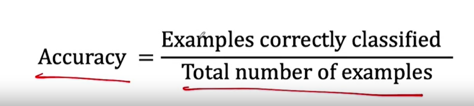 
  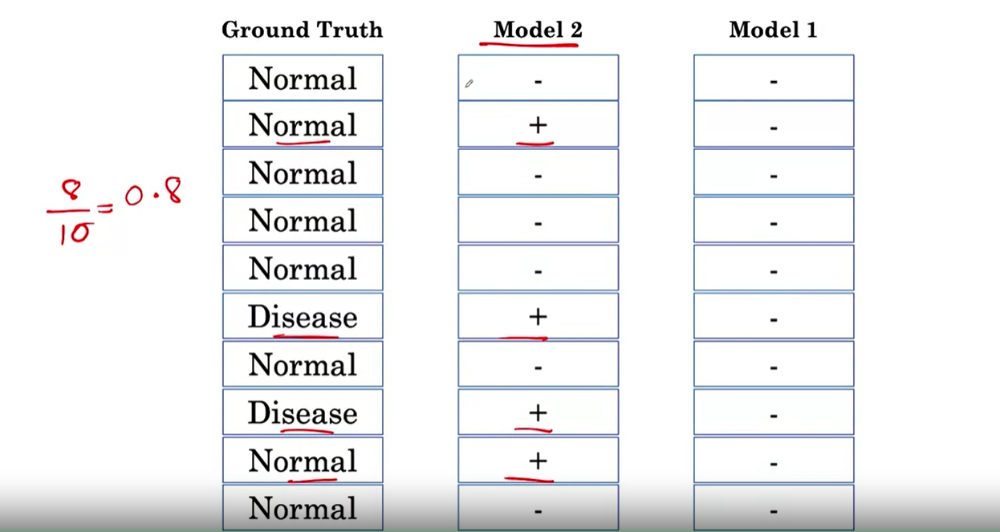  
</p>


<br />

### - Accuracy = Examples correctly classified / Total number of examples = ( TP + TN ) / ( TP + TN + FP + FN ).

<p float="center">
   
  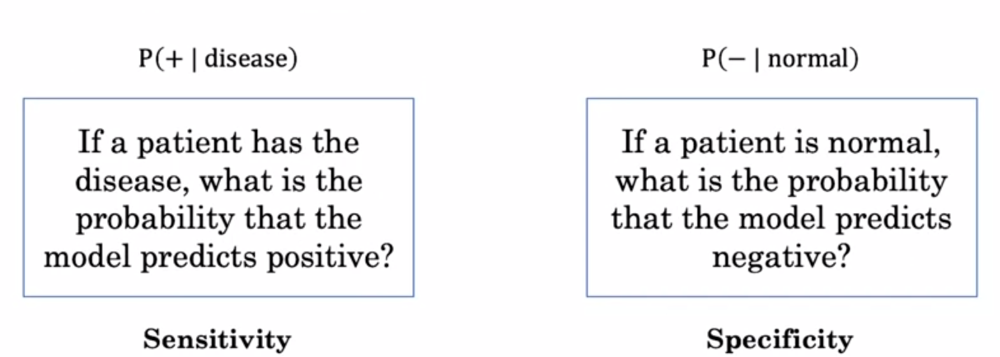  
  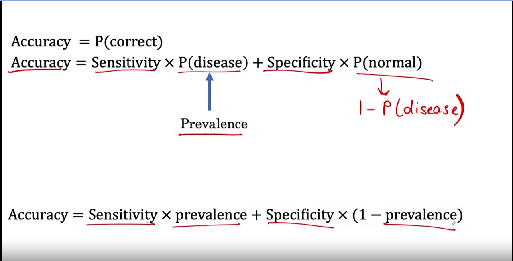
</p>

<br />

> __NOTE:__ prevalance = P(disease) and P(disease) + P(normal) = 1

<br />

### - __Sensitivity__ (True Positive Rate or Recall):

- ### How good the model is at correctly identifying those patients who actually have the disease and label them as having the disease.
- ### Sensitivity = P(predict positive | actual positive).
- ### Sensitivity = TP / ( TP + FN ) The probability of a patient having disease in a population is called the prevalance. 


<br />

### - __Specificity__ (True Negative Rate):
### How good the model is at correctly identifying the healthy patients as not having the disease.
- ### Specificity : P(predict negative | actual negative).
- ### Specificity = TN / ( TN + FP )

> __NOTE:__ that the terms "positive" and "negative" don't refer to the value of the condition of interest, but to its presence or absence; the condition itself could be a disease, so that "positive" might mean "diseased", while "negative" might mean "healthy".

### -  Positive(+) : when predicted correct given a patient has disease.
### - Negative(-) : when predicted correct given a patient has no disease.

<br />


### In medical diagnosis, test sensitivity is the ability of a test to correctly identify those with the disease (true positive rate), whereas test specificity is the ability of the test to correctly identify those without the disease (true negative rate).

<br />

<p float="center">
  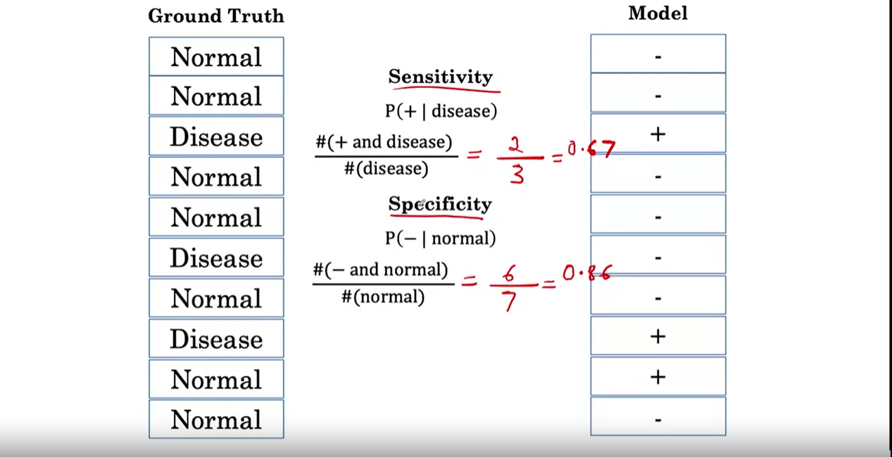  
  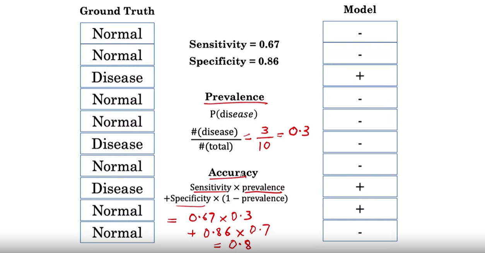
</p>


<br />


### - __Positive Predictive Value (PPV)__ :
### How good the model is at correctly identifying those patients who actually have the disease and label them as having the disease.
- ### PPV = P(actual positive | predict positive).
- ### P( disease | + ).
- ### PPV = TP / ( TP + FP ).
- ###  Comparable to Sensitivity which is P( + | disease ).

<br />

<p float="center">
  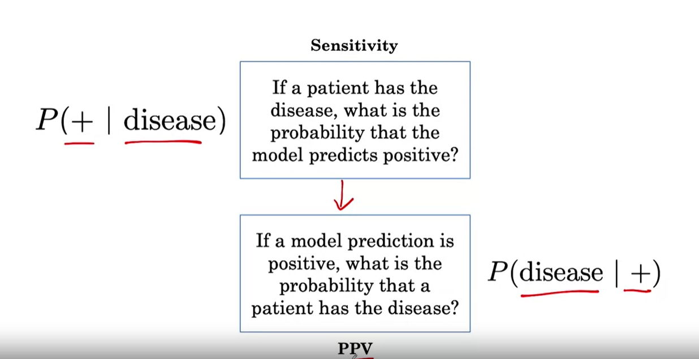  
</p>

<br />

### - __Negative Predictive Value (NPV)__ :
### How good the model is at correctly identifying the healthy patients as not having the disease.
- ### NPV = P(actual negative | predict negative).
- ### P( normal | - )
- ### TN / (TN + FN)
- ### Comparable to Specificity which is P( - | normal )

<p float="center">
  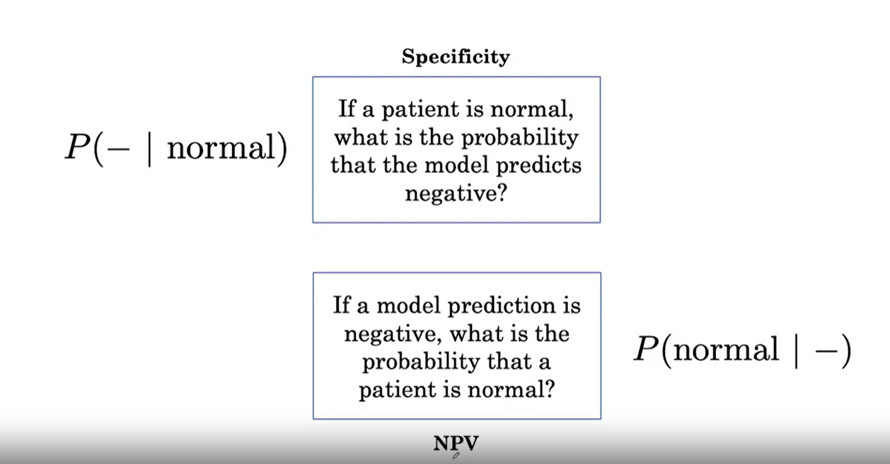  
</p>

<br />

<p float="center">
  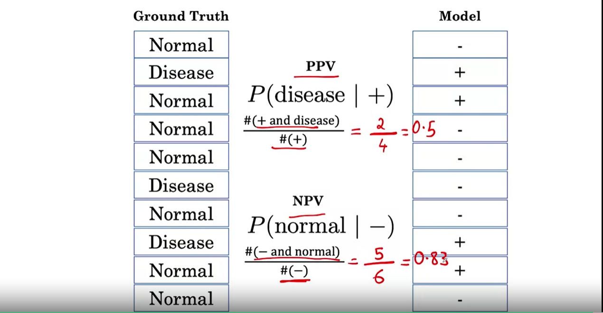  
  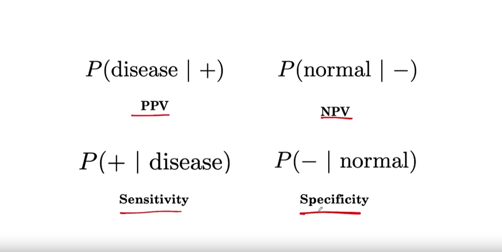 
</p>


<br />

### - __Confusion Matrix__ :

<p float="center">
  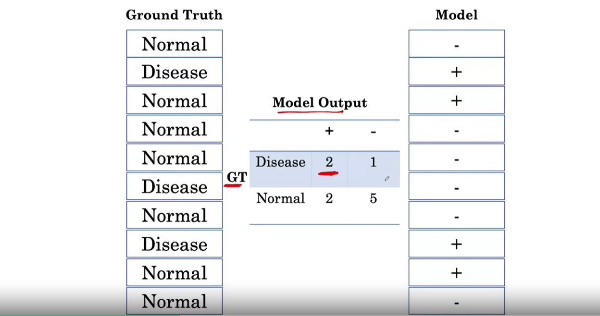  
  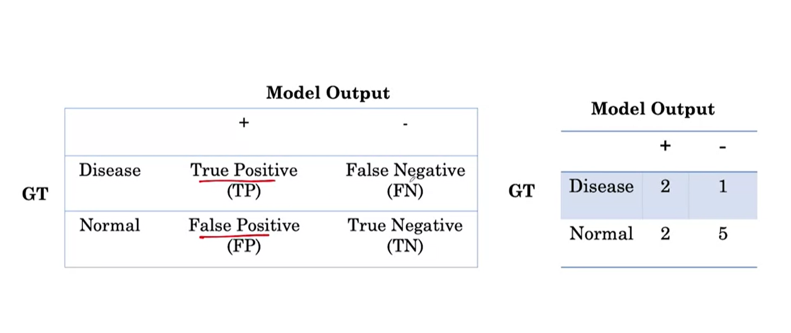 
  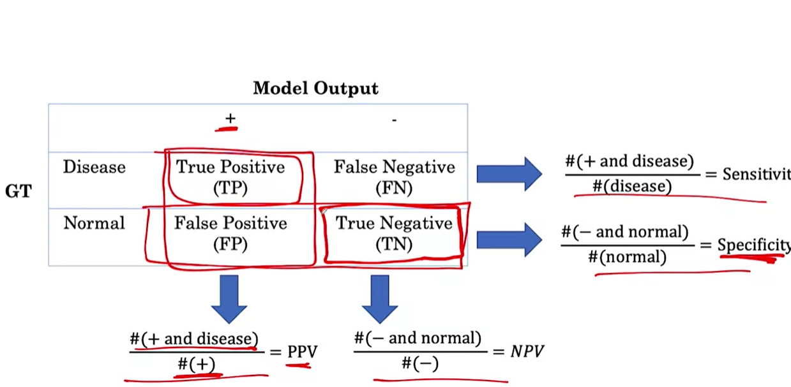  
  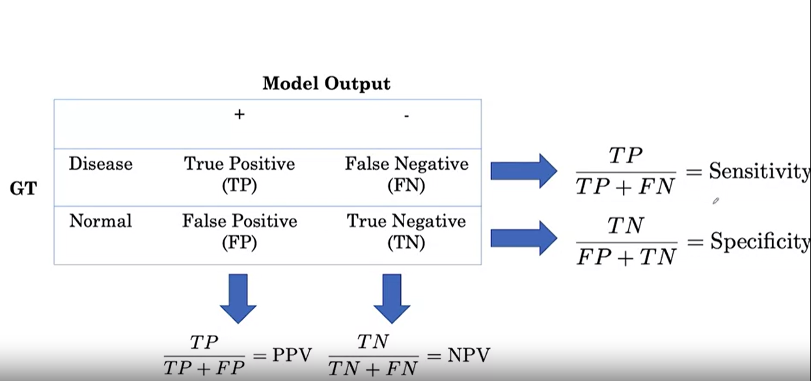 
</p>

<br />


<p float="center">
  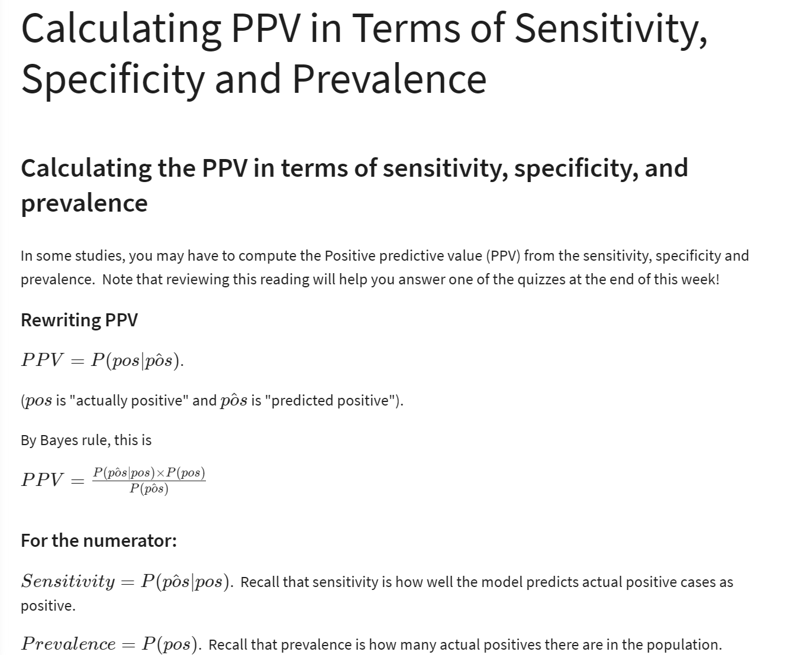  
  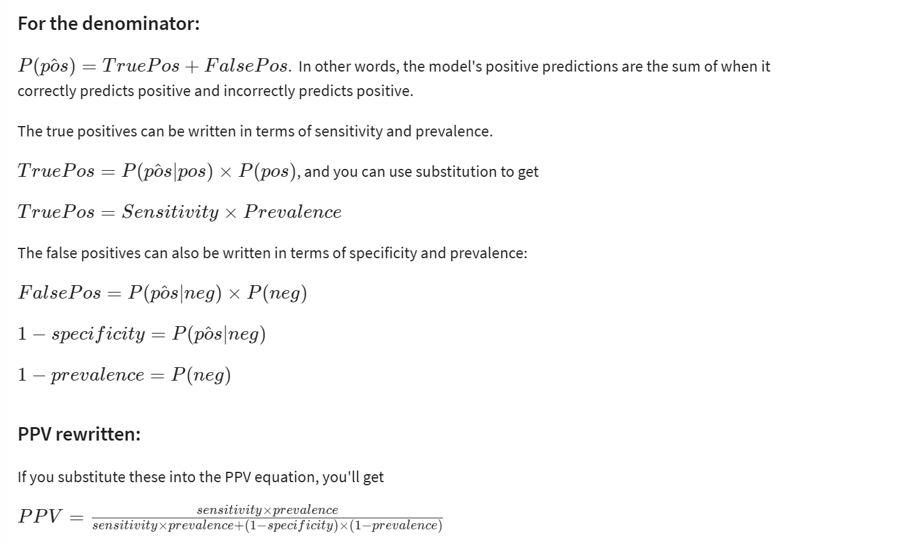 
</p>

----------------------------------

<br />

## __3. ROC Curve and Threshold:__

### ROC Curve: allow us to visualize the tradeoff between sensitivity and specificity for a given classifier and at different thresholds.

- ### Is Created by plotting the True Positive Rate (TPR) against the False Positive Rate (FPR) at various threshold settings. The ideal point is at the top left, with a true positive rate of 1 and a false positive rate of 0. The various points on the curve are generated by gradually moving the threshold from 1 to 0.

<p float="center">
  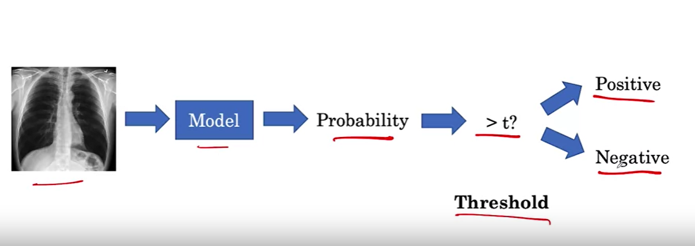  
  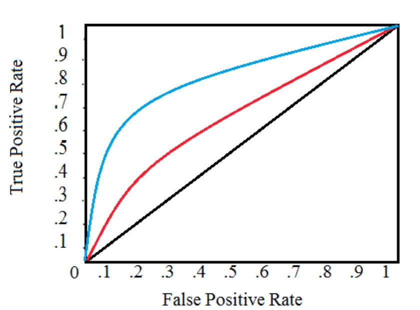  
</p>

<br />

- ### If the Probability is greater than Threshold then the model will predict positive. 
- ### If the Probability is less than Threshold then the model will predict negative. 

<br />


- ### __F1 Score__ : 
### is a the harmonic mean of the precision and recall. When the F1 score is high, it means that the precision and recall are both high. This means that the model is good at correctly identifying those patients who actually have the disease and label them as having the disease, and it is also good at correctly identifying the healthy patients as not having the disease. values range from 0 to 1, with 1 being the best and 0 being the worst. [__For more Informations__](./Accuracy%20vs.%20F1-Score.pdf)

<br />

## __Confidence Interval:__ 
### is a range of values that we are fairly sure our true value lies in. For example, if you measure the height of a child and you know that the height is 3.7 feet, then you are 95% confident that the true height of the child is between 3.5 and 3.9 feet. 

<p float="center">
  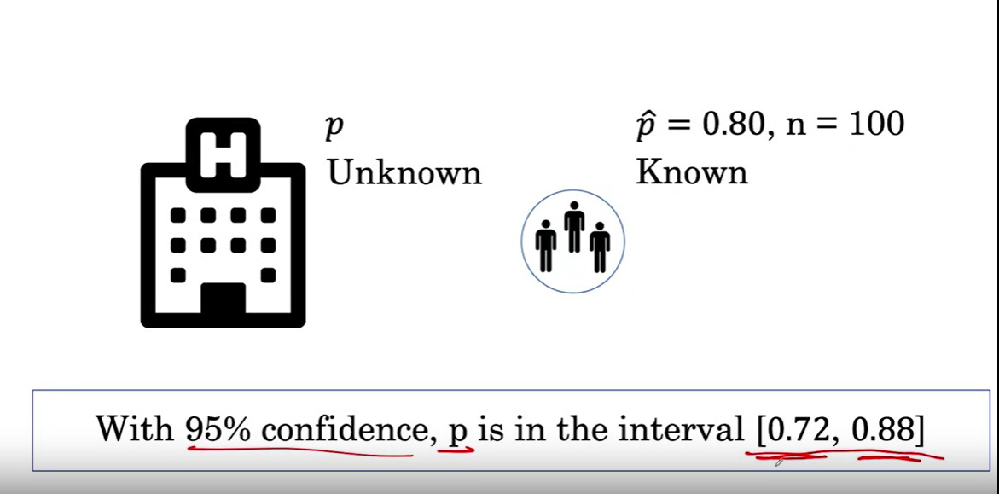   
  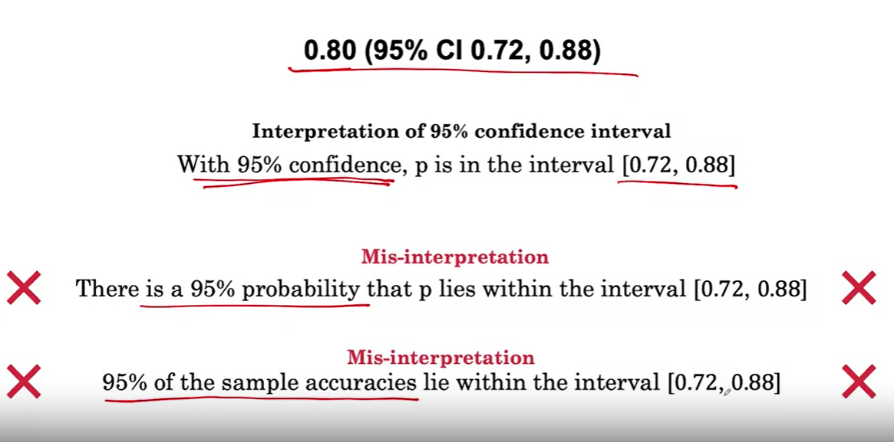 
</p>

<br />

- ### p: population accuracy. 
- ### p̂ : sample accuracy.

### -  In statistics, a confidence interval (CI) is a type of estimate computed from the statistics of the observed data. This proposes a range of plausible values for an unknown parameter (for example, the mean). The interval has an associated confidence level that the true parameter is in the proposed range. Given observations x_1,..., x_n and a confidence level, a valid confidence interval has a confidence level probability of containing the true underlying parameter. The level of confidence can be chosen by the investigator. In general terms, a confidence interval for an unknown parameter is based on sampling the distribution of a corresponding estimator.


### - For Example:
<p float="center">
  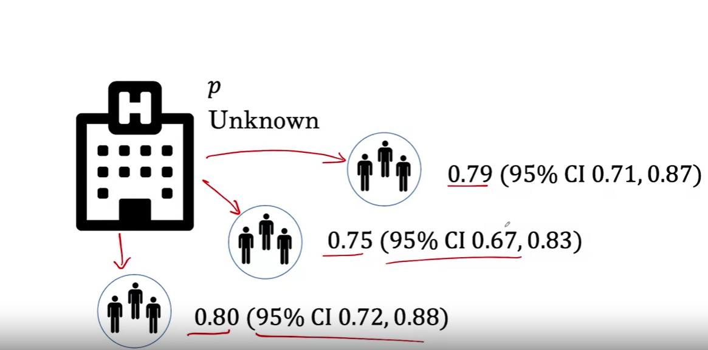   
  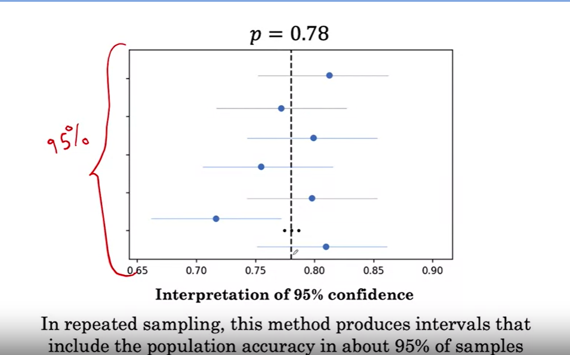 
</p>

<br />

--------------------

## ___Image Segmentation___ :

### MRI: Magnetic resonance imaging (MRI) is an advanced imaging technique that is used to observe a variety of diseases and parts of the body. At a high level, MRI works by measuring the radio waves emitting by atoms subjected to a magnetic field.

<p float="center">
  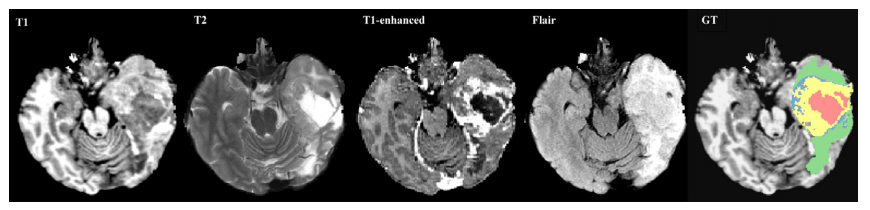   
</p>

<br />

### - The MRI scan is one of the most common image modalities that we encounter in the radiology field. Other data modalities include:
- ### CT scans
- ### X-rays
- ### Ultrasound


### - Compared to 2D image like X-rays, MRI sequence is a 3D volume.

<p float="center">
  

</p>


- ### The Main disadavantage of processing each MRI slice independently using a 2D segmentation model is you lose some context between slices.


<br />

- ### The key idea that we will use to combine the information from different sequences is to treat them as different channels.
  - ### Idea : RGB color channel -> Depth channel.
  - ### You can extend this idea to stacking more channels than just 3. (But there is a memory limit).
  - ### Challenge : Misalignment problem
  - ### Preprocessing : image Registration is the solution to the misalignment problem.


> __NOTE:__ most of the 3D volume data in medical setting needs preprocessing step of image registration.

<p float="center">
  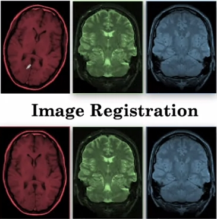

</p>


### **Segementation:**
- ### Segmentation is the process of partitioning an image into multiple segments. The goal of segmentation is to simplify and/or change the representation of an image into something that is more meaningful and easier to analyze. In Other words The process of defining the boundaries of various tissues.
- ### The task of determining the class of every point(in 2D : pixel, in 3D : voxel).
  
<p float="center">
  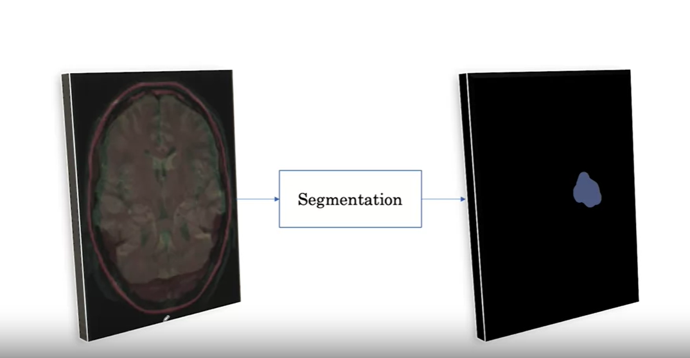

</p>

<br />


### - 2D Approach:
In the 2D approach, we break up the 3D MRI volume we've built into many 2D slices.


<p float="center">
  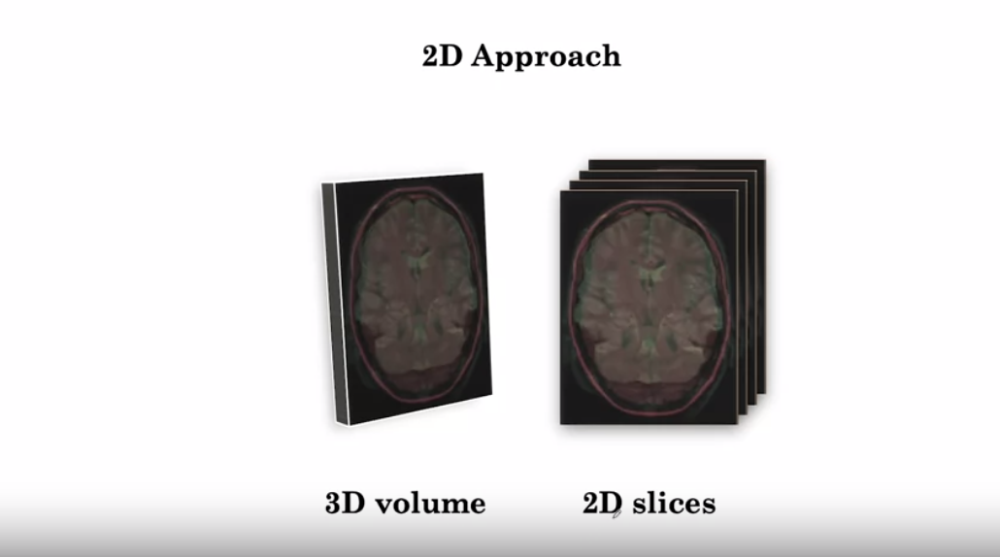

</p>

<br />

Each one of these slices is passed into a segmentation model which outputs the segmentation for that slice.

<p float="center">
  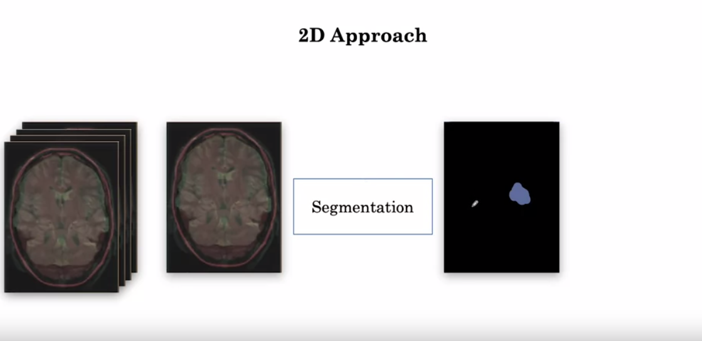

</p>

<br />

- ### The drawback with this 2D approach is that we might lose important 3D context when using this approach. For instance, if there is a tumor in one slice, there is likely to be a tumor in the slices right adjacent to it. Since we're passing in slices one at a time into the network, the network is not able to learn this useful context.

<br />


- ### 3D Approach:
In the 3D approach, we pass in the entire 3D volume into the network at once. This allows the network to learn the 3D context between slices.


### - what can we do instead to still have the model be able to get this context information in the depth dimension?

- ### In the 3D approach, we break up the 3D MRI volume into many 3D subvolumes. Each of these subvolumes has some width, height, and depth context

<p float="center">
  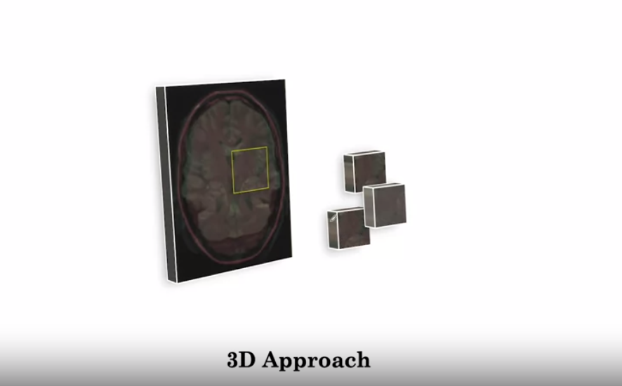

</p>

<br />

- ### like in the 2D approach, we can feed in the subvolumes now one at a time into the model and then aggregate them at the end to form a segmentation map for the whole volume. 

<p float="center">
  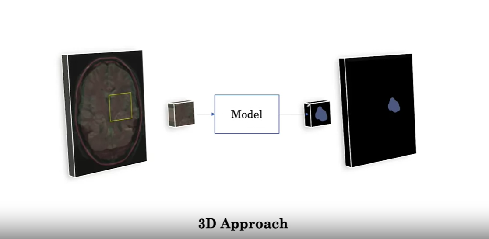

</p>


<br />

- ### The drawback with this 3D approach is that it is computationally expensive. The 3D subvolumes are much larger than the 2D slices, so we can't fit as many of them into memory at once. This means that we have to feed in fewer subvolumes into the network at once, which means that we have to train for more epochs to see the same number of subvolumes. This makes training much slower and we might still lose important spatial context. For instance, if there is a tumor in one subvolume, there is likely to be a tumor in the subvolumes around it too. Since we're passing in subvolumes one at a time into the network, the network will not be able to learn this possibly useful context. 


<br />

- ### U-Net Architecture:

<p float="center">
  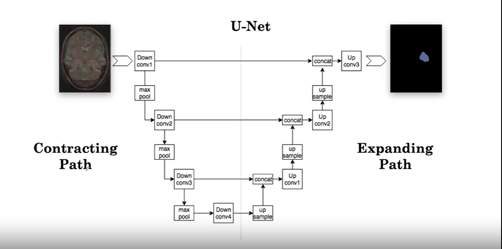
  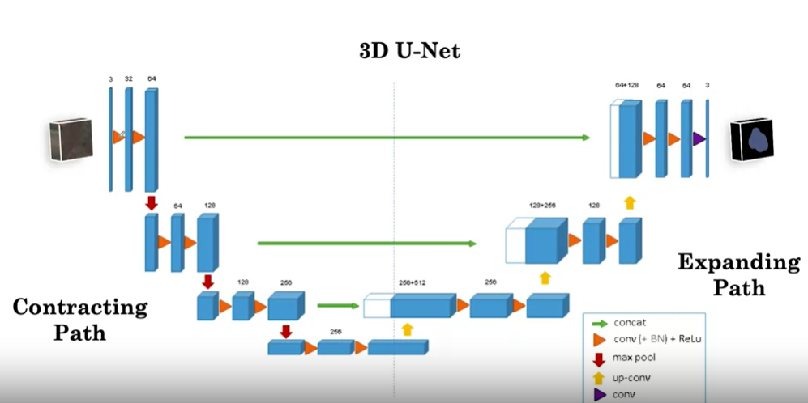
</p>


<br />

> Data Augmentation: when we rotate an input image by 90 degrees to produce a transformed input, we also need to rotate the output segmentations by 90 degrees to get our transformed output segmentation. The second difference is that we now have 3D volumes instead of 2D images. So, the transformations have to apply to the whole 3D volume. With this, we almost have all of the pieces necessary to train our brain tumor segmentation model. The final thing we need to look at is the loss function. In our loss function, we want to be able to specify the error. We should assign an example, given the model prediction and the ground truth.


<br />

- ### Loss Function:
  - ### Dice Loss: is a popular loss function for segmentation models. 
    - ### Works well in the presece of imbalanced data.
    - ### In our task of brain tumor segmentation, a very small fraction of the brain will be tumor regions.

<br />


- ### SOFT DICE LOSS:
  ### The soft dice loss will measure the error between our prediction map, P, and our ground truth map, G.

<p float="center">
  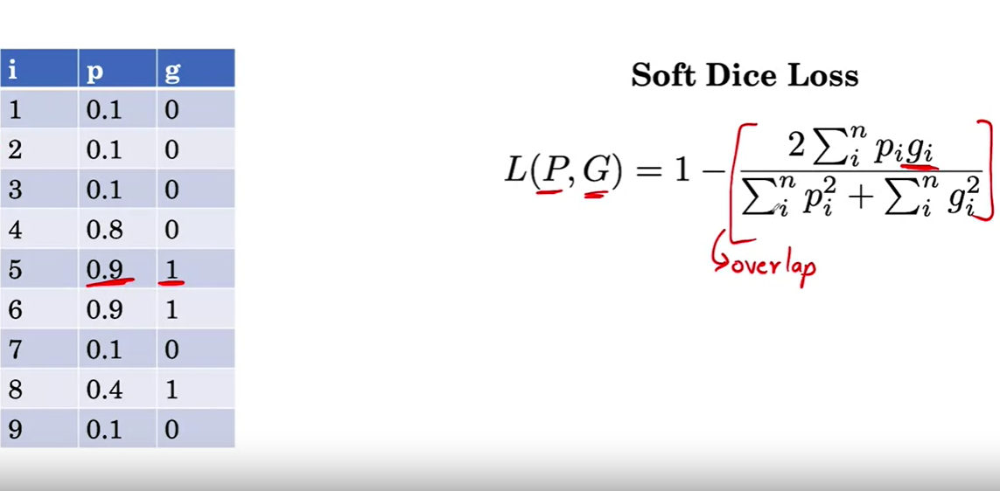
</p> 

### the red part measures the overlap between the predictions and the ground truth, and we want this fraction to be large. Here, when G over here is equal to 1, then we want P to be close to 1 so that this numerator term is large. We also want the denominator to be small. So when G equals 0, we want P to be close to 0. Otherwise, this term would be large and the denominator would be large. . Now, we take 1 minus this fraction, such that a higher loss corresponds to a small overlap and a low loss corresponds to a high overlap. 


<br />

### ___FOR EXAMPLE:___

<p float="center">
  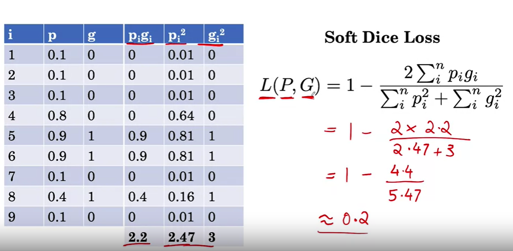

</p>

To compute the numerator of the loss for this example, we multiply P and G element wise to get pigi. For instance, 0.9 times 1 gives us 0.9, so that's entered here. To compute the denominator, we need the sum of squares of pi and the sum of squares of gi. Similarly, we can compute these by squaring the p column to get pi squared and g column to get gi squared. We can then sum up these columns to get the sum over all of the pixels. We can plug in these values into the soft dice loss for this particular example as 1- 2 times 2.2/2.47 + 3, which is 1- 4.4/5.47. And this comes out to approximately 0.2, which is the loss with this particular prediction, and with this particular ground truth for this example. The model optimizes this loss function to get better and better segmentations. This completes all of the pieces we need to be able to train our brain tumor segmentation model. We'll look at the evaluation of the segmentation model next.


<br />

```python

"""Pytorch implementation of Dice Loss"""
def dice_coeff(pred, target):
    smooth = 1.
    num = pred.size(0)
    m1 = pred.view(num, -1)  # Flatten
    m2 = target.view(num, -1)  # Flatten
    intersection = (m1 * m2).sum()

    return (2. * intersection + smooth) / (m1.sum() + m2.sum() + smooth)


class DiceLoss(nn.Module):
    def __init__(self, weight=None, size_average=True):
        super(SoftDiceLoss, self).__init__()

    def forward(self, logits, targets):
        probs = F.sigmoid(logits)
        num = targets.size(0)  # Number of batches

        score = dice_coeff(probs, targets)
        score = 1 - score.sum() / num
        return score

```

<br />

```python

"""python implementation of Soft Dice Loss"""
def soft_dice_loss(y_true, y_pred, epsilon=1e-6): 
    ''' 
    Soft dice loss calculation for arbitrary batch size, number of classes, and number of spatial dimensions.
    Assumes the `channels_last` format.
  
    # Arguments
        y_true: b x X x Y( x Z...) x c One hot encoding of ground truth
        y_pred: b x X x Y( x Z...) x c Network output, must sum to 1 over c channel (such as after softmax) 
        epsilon: Used for numerical stability to avoid divide by zero errors
    
    # References
        V-Net: Fully Convolutional Neural Networks for Volumetric Medical Image Segmentation 
        https://arxiv.org/abs/1606.04797
        More details on Dice loss formulation 
        https://mediatum.ub.tum.de/doc/1395260/1395260.pdf (page 72)
        
        Adapted from https://github.com/Lasagne/Recipes/issues/99#issuecomment-347775022
    '''
    
    # skip the batch and class axis for calculating Dice score
    axes = tuple(range(1, len(y_pred.shape)-1)) 
    numerator = 2. * np.sum(y_pred * y_true, axes)
    denominator = np.sum(np.square(y_pred) + np.square(y_true), axes)
    
    return 1 - np.mean(numerator / (denominator + epsilon)) # average over classes and batch

```

<br />


- ### External Validation:
  - ### To be able to measure the generalization of a model on a population that it hasn't seen, we want to be able to evaluate on a test set from the new population. This is called external validation. External validation can be contrasted with internal validation, when the test set is drawn from the same distribution as the training set for the model.


<p float="center">
  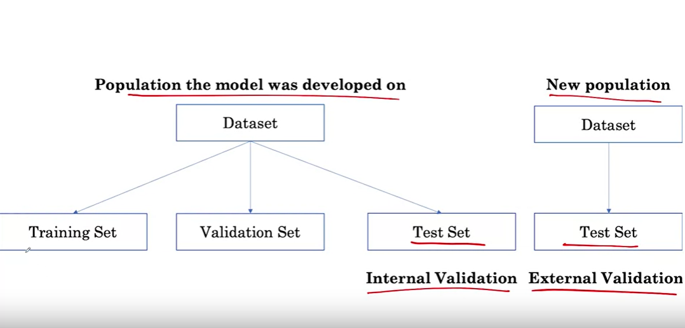

</p>

<br />

- ### If we find that we're not generalizing to the new population, then we could get a few more samples from the new population to create a small training and validation set and then fine-tune the model on this new data.

<p float="center">
  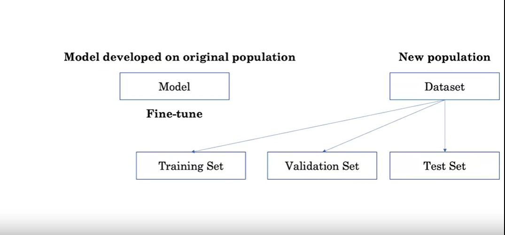

</p>