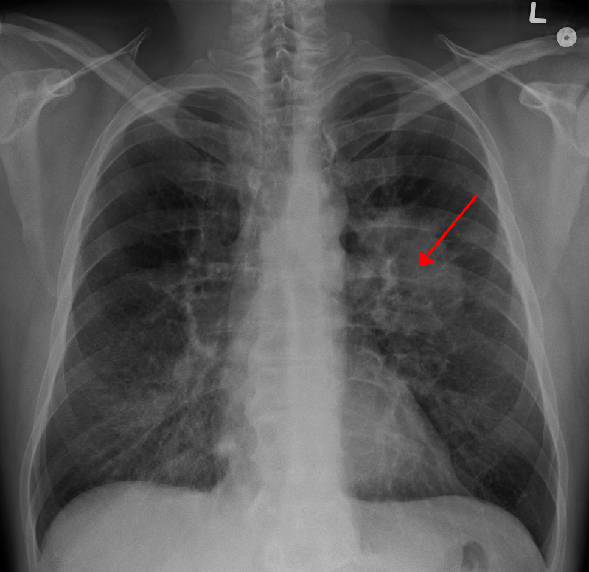
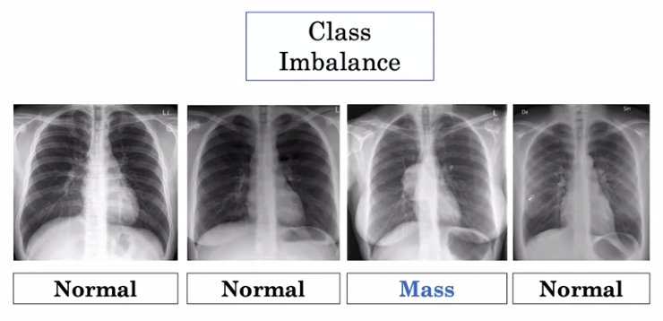
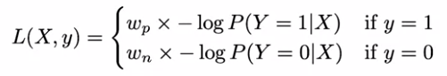
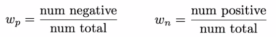
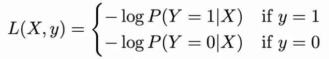

## 1. __AI for Medical Diagnosis:__

### - In particula, you will:
- ### Data preparation : Pre-process (visualization) and prepare a real-world X-ray dataset (data leakage prevention).
- ### Model development : Implement and evaluate a deep learning model for multi-class classification of chest pathology.
-  ### Model evaluation : Use various metrics (ROC, AUC, etc.) to evaluate your model and test its robustness.
-  ### Visualize model : Use GradCAMs to inspect model decisions and visually validate performance.

 
 

###  - Definition of "Lung Mass": A lung mass is defined as an abnormal spot or area in the lungs that are more than 3 centimeters (cm), about 1.5 inches, in size. Spots smaller than 3 cm in diameter are considered lung nodules. The most common causes of a lung mass differ from that of a lung nodule, as well as the chance that the abnormality may be cancer. [reference](https://www.verywellhealth.com/lung-mass-possible-causes-2249386)

 

### - __Training:__ During training, an algorithm is shown images of chest X-rays labeled with whether they contain a mass or not.
### - __Prediction:__ The algorithm produces an output in the form of scores, which are probabilities that the image contains a mass.
###  - ___Loss:___ From the probability score that the model predicted, we compute "Error" with the desired score.

 

## - Data Exploration & Image Pre-processing:
- ### Below are the common steps to check the data.
  ### 1. Data types and null values check.
  ### 2. Check the distribution of the data.
  ### 3. Unique IDs check.
  ### 4. Explore data labels.
  ### 5. Investigate a single image. 
  ### 6. Investigate pixel value distribution.
  ### 7. Standardization by subtracting the mean and dividing by the standard deviation.

 

## - How to handle class imbalance and small training sets:
### It is worth noting that our dataset contains multiple images for each patient. This could be the case, for example, when a patient has taken multiple X-ray images at different times during their hospital visits. In our data splitting, we have ensured that the split is done on the patient level so that there is no data "leakage" between the train, validation, and test datasets.

### - ___Image Classfication and Class Imbalance:___
- ### Three Key Challenges

    - ### Class Imbalance
    - ### Multi-Task
    - ### Dataset Size

 

- ### __Class Imbalance Problem:__ it's common to have not an equal number of examples of non-disease and disease.

 

###  to solve "Class Imbalance":

- ### Weighted Loss : By counting the number of each labels and modifying the loss function to weighted loss with the ratio of each label.

   
  

 

- ### Resampling : Re-sample the dataset such that we have an equal number of normal and abnormal examples. 
    - ### With Resampling, you can use just standard loss function (not a weighted loss function).
- ###  There are many variations of Resampling:
  - ### Oversampling the normal/abnormal case.
  - ### Undersampling the normal/abnormal case.

 

### - For if you find that your training set has 70% negative examples and 30% positive:

- ### reweight examples in training loss.
- ### undersample negative examples.
- ### oversample positive examples.

 

### - __Binary Cross Entropy Loss Function__:
- ### Binary Cross Entropy Loss Function is used for binary classification problems.

   

 

### - __Multi-task challenge:__
- ### In the real world, we often have multiple labels for a single image. For example, a patient may have multiple diseases, or a patient may have multiple abnormalities in a single image. In this case, we need to predict multiple labels for a single image. This is called a multi-task problem.

 

### - __Dataset Size:__

- ### the common dataset size in medical imaging is about 10 thousand to 100 thousand. This is a small dataset compared to the millions of images in ImageNet. This is because it is expensive to collect medical images and it requires a lot of expertise to label the images. In addition, medical images are often private and sensitive, so it is difficult to share them with others.

### - __Transfer Learning:__
- ### Transfer learning is a technique that allows us to use a pre-trained model on a new dataset. This is useful when we have a small dataset and we want to use a pre-trained model that was trained on a large dataset. In this case, we can use the pre-trained model as a starting point and fine-tune the model on our dataset. This is called transfer learning.

- ### How to use transfer learning:
  - ### To fune tune all of the layers. (We use this method when we have a big dataset.)
  - ### To freeze some of the layers and only fine tune the last few layers. (We use this method when we have a small dataset.)
  - ### To freeze all of the layers. (We use this method when we have a very small dataset.)

 

### - __Data Augmentation:__
- ### Data augmentation is a technique that allows us to increase the size of our dataset by applying transformations to the images. For example, we can flip the image horizontally or vertically, or we can rotate the image by 90 degrees. This is useful when we have a small dataset and we want to increase the size of our dataset. In this case, we can apply data augmentation to our dataset to increase the size of our dataset.

 

### - __Data Leakage:__
- ### In Machine learning, Data Leakage refers to a mistake that is made by the creator of a machine learning model in which they accidentally share the information between the test and training data sets. Typically, when splitting a data set into testing and training sets, the goal is to ensure that no data is shared between these two sets. Ideally, there is no intersection between these two sets. This is because the purpose of the testing set is to simulate the real-world data which is unseen to that model. However, when evaluating a model, we do have full access to both our train and test sets, so it is our duty to ensure that there is no overlapping between the training data and the testing data.
- ### As a result, due to the Data leakage, we got unrealistically high levels of performance of our model on the test set, because that model is being run on data that it had already seen in some capacity in the training set. The model effectively memorizes the training set data and is easily able to correctly output the labels or values for those examples of the test dataset. Clearly, this is not ideal, as it misleads the person who evaluates the model. When such a model is then used on truly unseen data that is coming mostly on the production side, then the performance of that model will be much lower than expected after deployment. 
- ### When you split your data into training and testing subsets, some of your data present in the test set is also copied in the train set and vice-versa. As a result of which when you train your model with this type of split it will give really good results on the train and test set i.e, both training and testing accuracy should be high. But when you deploy your model into production it will not perform well, because when a new type of data comes in it won’t be able to handle it.

### - __How does it exactly happen?__
### In simple terms, Data Leakage occurs when the data used in the training process contains information about what the model is trying to predict. It appears like “cheating” but since we are not aware of it so, it is better to call it “leakage” instead of cheating. Therefore, Data leakage is a serious and widespread problem in data mining and machine learning which needs to be handled well to obtain a robust and generalized predictive model.

 

### - __How to prevent Data Leakage?__
- ### Create a Separate Validation Set:

   

 

### __The Problem of Random Sampling:__
- ### Random sampling is a common technique used in machine learning. It is used to split the dataset into training, validation, and test sets. However, random sampling can lead to data leakage. This is because random sampling does not take into account the fact that the data is not evenly distributed. For example, if we have a dataset with 1000 images, and 900 of them are normal and 100 of them are abnormal, then random sampling will lead to data leakage. This is because the training set will contain more normal images than abnormal images, and the validation set will contain more abnormal images than normal images. This will lead to data leakage.

- ### To get a good estimate of the performance of the model both on non-disease and disease examples,
  - ### sampling oreder : Test , Validation , Training.
  - ### sample a tests tset to have at least X % of examples of our minority class.
  - ### sample to have same distribution of classes as the test set. (same sampling strategy should be used).
  - ### Remaining patients in Training set : Since test and validation set have been artificially sampled to have a large fraction of disease examples. (In the presence of imbalance data, you can still train your model!)
  - ### It's bad to have patients in both training and test sets : Overly optimistic test performace.
